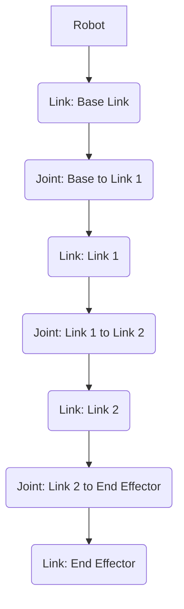

import { FaCubes, FaLink, FaCogs } from 'react-icons/fa';


The **Unified Robot Description Format (URDF)** is an XML-based file format used in ROS 2 to describe all physical aspects of a robot. A well-defined URDF model is crucial for visualization in tools like RViz, realistic simulation in platforms like Gazebo and Isaac Sim, and for motion planning and control in both simulated and real hardware.

## 4.1. Understanding URDF Structure

A URDF file describes a robot as a tree of **links** connected by **joints**.

<div className="card" style={{margin: '2rem 0'}}>
  <div className="card__header" style={{backgroundColor: 'var(--ifm-color-primary-dark)', color: 'white'}}>
    <h3><FaCogs /> Core URDF Components</h3>
  </div>
  <div className="card__body">
    <ul>
      <li>**Links <FaLink />**: Represent the rigid bodies of the robot (e.g., base, arm segments, end-effector). Each link has properties like mass, inertia, visual geometry, and collision geometry.</li>
      <li>**Joints**: Connect two links, defining their relative motion (e.g., `fixed`, `revolute`, `prismatic`). Joints specify the axis of motion, limits, and dynamics.</li>
    </ul>
  </div>
</div>

### Basic URDF Hierarchy:



### Example: Simple Two-Link Arm

Let's create a minimal URDF for a simple two-link robotic arm to illustrate these concepts.

:::info URDF File Example
Create `my_ros2_package/urdf/two_link_arm.urdf`:
:::
```xml
<?xml version="1.0"?>
<robot name="two_link_arm">

  {/* Base Link */}
  <link name="base_link">
    <visual>
      <geometry>
        <box size="0.1 0.1 0.05"/>
      </geometry>
      <material name="blue">
        <color rgba="0 0 1 1"/>
      </material>
    </visual>
    <collision>
      <geometry>
        <box size="0.1 0.1 0.05"/>
      </geometry>
    </collision>
    <inertial>
      <mass value="0.5"/>
      <inertia ixx="0.001" ixy="0" ixz="0" iyy="0.001" iyz="0" izz="0.001"/>
    </inertial>
  </link>

  {/* Joint 1: Connects base_link to link1 */}
  <joint name="joint1" type="revolute">
    <parent link="base_link"/>
    <child link="link1"/>
    <origin xyz="0 0 0.025" rpy="0 0 0"/>
    <axis xyz="0 0 1"/>
    <limit lower="-1.57" upper="1.57" effort="100" velocity="10"/>
  </joint>

  {/* Link 1 */}
  <link name="link1">
    <visual>
      <geometry>
        <cylinder radius="0.02" length="0.2"/>
      </geometry>
      <origin xyz="0 0 0.1" rpy="0 0 0"/>
      <material name="green">
        <color rgba="0 1 0 1"/>
      </material>
    </visual>
    <collision>
      <geometry>
        <cylinder radius="0.02" length="0.2"/>
      </geometry>
      <origin xyz="0 0 0.1" rpy="0 0 0"/>
    </collision>
    <inertial>
      <mass value="0.1"/>
      <origin xyz="0 0 0.1" rpy="0 0 0"/>
      <inertia ixx="0.0001" ixy="0" ixz="0" iyy="0.0001" iyz="0" izz="0.0001"/>
    </inertial>
  </link>

  {/* Joint 2: Connects link1 to link2 */}
  <joint name="joint2" type="revolute">
    <parent link="link1"/>
    <child link="link2"/>
    <origin xyz="0 0 0.2" rpy="0 0 0"/>
    <axis xyz="0 1 0"/>
    <limit lower="-1.57" upper="1.57" effort="100" velocity="10"/>
  </joint>

  {/* Link 2 */}
  <link name="link2">
    <visual>
      <geometry>
        <box size="0.05 0.05 0.1"/>
      </geometry>
      <origin xyz="0 0 0.05" rpy="0 0 0"/>
      <material name="red">
        <color rgba="1 0 0 1"/>
      </material>
    </visual>
    <collision>
      <geometry>
        <box size="0.05 0.05 0.1"/>
      </geometry>
      <origin xyz="0 0 0.05" rpy="0 0 0"/>
    </collision>
    <inertial>
      <mass value="0.05"/>
      <origin xyz="0 0 0.05" rpy="0 0 0"/>
      <inertia ixx="0.00001" ixy="0" ixz="0" iyy="0.00001" iyz="0" izz="0.00001"/>
    </inertial>
  </link>

</robot>
```

## 4.2. Visualizing URDF with RViz

RViz is ROS 2's primary visualization tool. You can use it to display your URDF model and debug its structure.

### Launching RViz with your URDF:
A typical launch file for this would involve:
1.  **`robot_state_publisher`**: Reads the URDF and publishes the robot's `tf2` transforms.
2.  **`joint_state_publisher`**: Provides a GUI to manually control the joint states.
3.  **`rviz2`**: The visualization tool itself, configured to display the robot model.

## 4.3. Beyond Basic URDF: XACRO

For complex robots, writing URDFs by hand can be tedious and error-prone. **XACRO (XML Macros)** is a macro language that simplifies URDF creation by allowing you to define constants, create macros for reusable components, and perform mathematical operations.

:::tip Best Practice
Always use XACRO for any non-trivial robot model to improve modularity and maintainability.
:::

## Conclusion

A well-crafted URDF is the digital blueprint of your robot. It's the essential first step in bringing your robot to life in simulation and is the foundation for almost all higher-level robotics tasks, from motion planning to control. Mastering URDF and XACRO is a fundamental skill for any serious roboticist.
