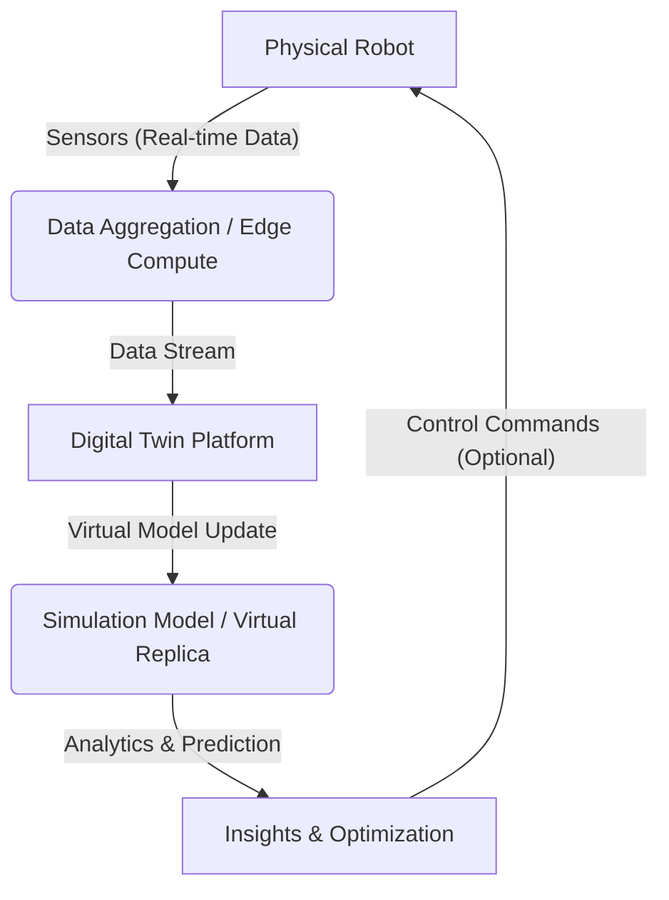

# Module 2: Digital Twin Overview

The concept of a **Digital Twin** has emerged as a powerful paradigm in the realm of Physical AI and robotics, promising to revolutionize how we design, develop, test, and deploy intelligent autonomous systems. A digital twin is essentially a virtual replica of a physical asset, process, or system, continuously updated with real-time data from its physical counterpart. This dynamic connection enables unprecedented levels of insight, prediction, and control.

## 2.1. What is a Digital Twin?

A digital twin is more than just a simulation model. It's a living, breathing virtual counterpart that mirrors its physical twin in real-time. This mirroring is achieved through a continuous flow of data from sensors attached to the physical asset, feeding into the virtual model.

### Key Components of a Digital Twin:

-   **Physical Asset**: The real-world robot, manufacturing plant, or system.
-   **Virtual Model**: A detailed, physics-based simulation of the physical asset.
-   **Data Connection**: Sensors on the physical asset continuously stream data to the virtual model.
-   **Analytics and Insights**: The virtual model uses this data to provide insights, predict behavior, and optimize performance.
-   **Bi-directional Link (Optional but powerful)**: The virtual model can often send commands back to the physical asset, enabling closed-loop control and autonomous adaptation.

## 2.2. The Digital Twin in Robotics Development

For robotics, digital twins offer a transformative approach to the entire development lifecycle. They bridge the gap between theoretical design and real-world performance, enabling faster iteration and more reliable systems.

### Applications in Robotics:

-   **Design and Prototyping**: Rapidly test new robot designs or configurations in a virtual environment.
-   **Simulation and Testing**: Conduct extensive simulations, including failure scenarios, without risking physical hardware.
-   **Remote Monitoring and Diagnostics**: Monitor robot health and performance from anywhere, diagnosing issues proactively.
-   **Predictive Maintenance**: Anticipate failures based on virtual model predictions and historical data.
-   **Operator Training**: Train human operators in a safe, virtual environment.
-   **Reinforcement Learning**: Train AI agents in simulation before deploying them to the physical robot.

## 2.3. Digital Twin vs. Simulation: What's the Difference?

While both digital twins and simulations involve virtual models, their key difference lies in their connection to the physical world and their lifecycle.

| Feature          | Simulation                                       | Digital Twin                                                                    |
| :--------------- | :----------------------------------------------- | :------------------------------------------------------------------------------ |
| **Purpose**      | Model behavior under specific conditions         | Mirror physical asset behavior, predict, optimize, and control                   |
| **Data Flow**    | Input data is predefined or generated            | Continuously updated with real-time data from physical twin                    |
| **Lifecycle**    | Typically used for a specific study              | Exists throughout the lifecycle of the physical asset                            |
| **Fidelity**     | Can vary, often focused on specific aspects      | Aims for high fidelity, representing all critical aspects of the physical twin   |
| **Real-time Link** | Generally none or limited                        | Strong, often continuous, real-time connection to physical counterpart         |

## 2.4. Challenges and Future of Digital Twins

Implementing digital twins, especially for complex robotic systems, comes with challenges:

-   **Data Management**: Handling massive streams of sensor data.
-   **Model Fidelity**: Ensuring the virtual model accurately represents the physical twin.
-   **Integration Complexity**: Connecting diverse systems (sensors, simulations, analytics platforms).
-   **Security**: Protecting sensitive operational data.

Despite these, the future of digital twins in robotics is bright, with advancements in AI, IoT, and cloud computing continuously enhancing their capabilities. They are poised to become an integral part of autonomous system development and operation.

## Conclusion

Digital twins are more than just a technological trend; they are a fundamental shift in how we interact with and develop complex physical systems. By providing a dynamic, real-time virtual representation of our robots, digital twins empower engineers and AI developers to achieve unprecedented levels of efficiency, reliability, and innovation in Physical AI and humanoid robotics.
