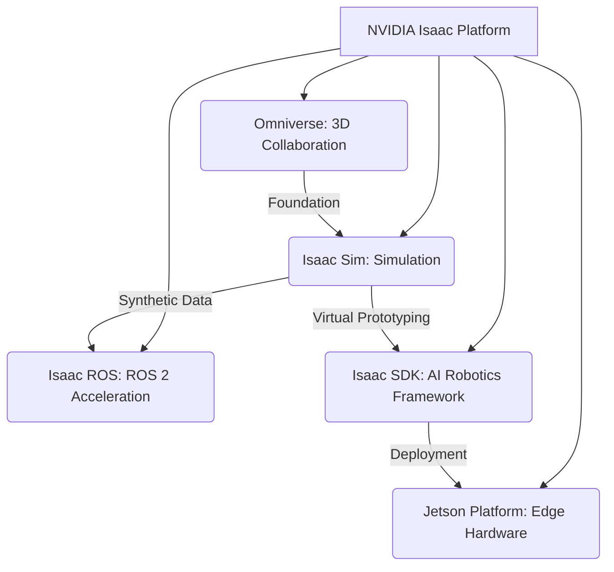

# Module 3: NVIDIA Isaac Overview

The **NVIDIA Isaac platform** stands as a pivotal ecosystem designed to accelerate the development, simulation, and deployment of AI-powered robots. Leveraging NVIDIA's expertise in GPU computing and artificial intelligence, Isaac provides a comprehensive suite of tools that bridge the gap between virtual prototyping and real-world robotic applications. This module introduces the core components of the Isaac platform and highlights its transformative impact on the robotics landscape.

## 3.1. The Isaac Ecosystem: A Unified Approach

NVIDIA Isaac is more than just a single product; it's a unified platform comprising various interoperable components that cater to different stages of the robotics development pipeline. This integrated approach allows developers to move seamlessly from simulation to deployment, ensuring consistency and accelerating innovation.

### Key Components:

-   **Isaac Sim**: A powerful, physically accurate robotics simulator built on NVIDIA Omniverse, enabling photorealistic simulations and synthetic data generation.
-   **Isaac ROS**: A collection of hardware-accelerated packages for ROS 2, leveraging NVIDIA GPUs for high-performance perception, navigation, and manipulation.
-   **Isaac SDK**: A comprehensive software development kit for building AI-powered robot applications, providing a framework for perception, navigation, and manipulation.
-   **Jetson Platform**: A series of embedded computing boards with integrated GPUs, optimized for AI at the edge, serving as the target hardware for Isaac-powered robots.
-   **Omniverse**: A platform for connecting and building 3D virtual worlds, forming the foundation for Isaac Sim's advanced simulation capabilities.

## 3.2. Why NVIDIA Isaac for Robotics?

The choice of the Isaac platform for robotics development is driven by several compelling advantages:

-   **GPU Acceleration**: Unlocks massive parallel processing power for AI workloads (perception, path planning, reinforcement learning) and physics simulations.
-   **Realistic Simulation**: Isaac Sim provides high-fidelity, physically accurate, and photorealistic environments, crucial for developing robust AI models.
-   **Synthetic Data Generation**: Generate vast amounts of diverse training data in simulation, overcoming the limitations and costs of real-world data collection.
-   **ROS 2 Integration**: Isaac ROS seamlessly integrates with the ROS 2 ecosystem, providing accelerated nodes and tools.
-   **End-to-End Development**: Supports the entire robot development lifecycle, from design and simulation to testing and deployment on edge devices.
-   **AI Integration**: Native integration of advanced AI models for perception, natural language understanding, and decision-making.

## 3.3. Isaac's Role in Physical AI and Humanoid Robotics

For Physical AI and humanoid robotics, the Isaac platform is particularly impactful:

-   **Humanoid Simulation**: Simulate complex humanoid kinematics and dynamics in realistic environments.
-   **VLA Development**: Train Visual Language Action models in simulation with synthetic data before transferring to physical humanoids.
-   **Edge AI for Humanoids**: Deploy high-performance AI perception and control algorithms directly onto Jetson-powered humanoids.
-   **Reinforcement Learning**: Facilitate large-scale reinforcement learning for complex behaviors in simulation.

## Conclusion

NVIDIA Isaac represents a significant leap forward in robotics development, providing a powerful, integrated, and GPU-accelerated platform. By harnessing Isaac Sim, Isaac ROS, and the Jetson platform, developers can accelerate the creation of highly intelligent and capable Physical AI and humanoid robots, pushing the boundaries of autonomous systems.