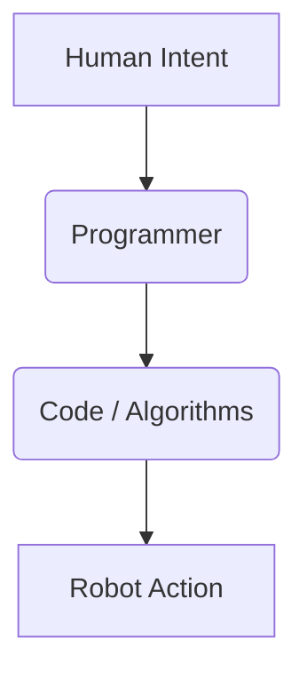

# Module 4: VLA & Humanoid Robotics Overview

The intersection of large language models, computer vision, and robotics has given rise to a groundbreaking field: **Visual Language Action (VLA) models**. These models are poised to revolutionize how humans interact with robots, particularly humanoids, by enabling them to understand and execute complex tasks described through natural language and visual cues. This module provides a comprehensive overview of VLAs and their profound impact on humanoid robotics.

## 6.1. The Challenge of Human-Robot Interaction

Historically, programming robots required specialized knowledge, often involving complex coding and precise mathematical models for every action. This created a significant barrier between human intent and robot execution. VLAs aim to dismantle this barrier.

### Traditional Robotics Interface:



### VLA-Empowered Robotics Interface:

```mermaid
graph TD
    A[Human Intent (Natural Language/Visual)] --> B(VLA Model);
    B --> C(Robot Action);
```

## 6.2. What are Visual Language Action (VLA) Models?

VLA models are a class of AI models that combine visual perception, language understanding, and decision-making to generate actions in physical environments. They are often built upon advancements in large language models (LLMs) and foundation models, extended with robotic action spaces.

### Key Characteristics:

-   **Multi-modality**: Process both visual inputs (images, video) and linguistic inputs (text, speech).
-   **Grounding**: Connect abstract language concepts to concrete physical actions and environmental states.
-   **Reasoning**: Perform complex planning and decision-making to achieve high-level goals.
-   **Generalization**: Adapt to novel tasks and environments with minimal retraining.

## 6.3. Architecture of VLA Models

While diverse, many VLA architectures share common components:

1.  **Vision Encoder**: Processes visual inputs (e.g., camera feeds) into a rich representation.
2.  **Language Encoder**: Processes natural language instructions into a contextual representation.
3.  **Cross-modal Fusion**: Combines visual and language embeddings to create a joint understanding of the scene and instruction.
4.  **Action Decoder/Planner**: Generates a sequence of low-level robot actions or a high-level plan to fulfill the interpreted instruction.
5.  **World Model (Implicit/Explicit)**: An internal representation of the environment, objects, and robot's capabilities.

### Conceptual VLA Architecture:

```mermaid
graph TD
    A[Visual Input (Camera)] --> B(Vision Encoder);
    D[Language Instruction] --> E(Language Encoder);
    B & E --> F(Cross-modal Fusion);
    F --> G(Action Decoder/Planner);
    G --> H[Robot Actions];
```

## 6.4. VLAs in Humanoid Robotics

Humanoid robots, with their human-like form and dexterity, are an ideal platform for VLAs. They can leverage VLA capabilities to:

-   **Follow complex verbal commands**: "Pick up the red mug and put it on the shelf."
-   **Understand contextual cues**: "Hand me the tool next to the blue box."
-   **Learn new tasks through demonstration and language**: Observe a human action, then receive linguistic instruction for similar tasks.
-   **Adapt to dynamic environments**: Use visual feedback to adjust actions based on changes in the scene.
-   **Perform intricate manipulation**: Execute fine-grained movements based on abstract instructions.

### Example: VLA for a Humanoid Picking Task (Conceptual)

```python
# Conceptual Python snippet for a VLA-driven humanoid task
# This would involve sophisticated vision, language processing, and control
class VLAGroundedHumanoid:
    def __init__(self, robot_interface):
        self.robot = robot_interface
        # Load VLA model (e.g., from HuggingFace, custom trained)
        self.vla_model = load_vla_model()

    def execute_command(self, natural_language_command, current_image):
        # Process command and image through VLA model
        action_plan = self.vla_model.plan_action(natural_language_command, current_image)

        # Execute actions
        for action in action_plan:
            self.robot.execute_primitive_action(action)
            # Optionally, get visual feedback and re-plan
            # current_image = self.robot.get_camera_feed()

# Assuming a robot interface exists
# robot_controller = HumanoidRobotInterface()
# vla_agent = VLAGroundedHumanoid(robot_controller)

# Example usage:
# vla_agent.execute_command("pick up the red block", camera_feed_image)
```

## 6.5. Challenges and Future Directions

Despite their promise, VLAs in humanoid robotics face challenges:

-   **Data Scarcity**: Training data for language-grounded robotic actions is limited.
-   **Generalization**: Ensuring robustness across diverse environments and novel tasks.
-   **Safety and Reliability**: Critical for real-world deployment.
-   **Computational Cost**: VLAs are often large models requiring significant compute.

Future directions involve developing more efficient architectures, enhancing generalization capabilities, and focusing on safe and robust deployment strategies for autonomous humanoids.

## Conclusion

VLA models are transforming humanoid robotics by enabling more intuitive and natural human-robot interaction. By bridging visual perception and language understanding with physical action, VLAs pave the way for humanoids that can intelligently interpret and execute complex commands, unlocking unprecedented levels of autonomy and adaptability in the physical world.